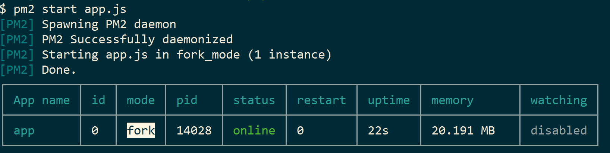
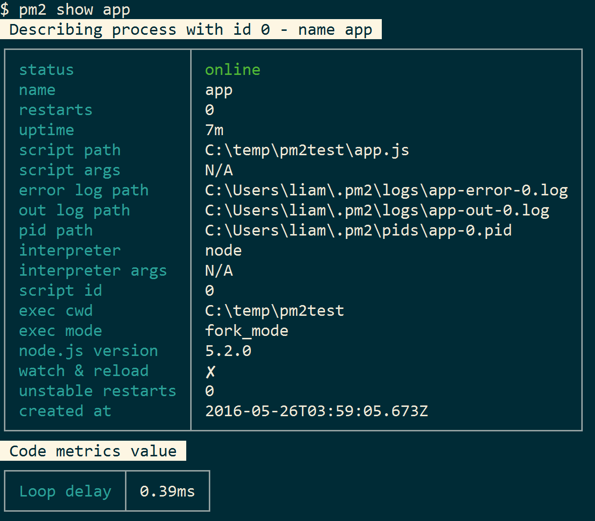

> Have a build process to produce a deployable (non-development) package. Host on Linux with pm2 to manage processes and restarts. Move files with rsync. Perform installation activities with ssh. Reverse proxy through nginx for improved performance and SSL termination.

For information about *how* to build a node.js web application see [Building a Web Application with Node and Typescript](http://withouttheloop.com/articles/2016-03-24-node-web-ts/).

Build a Deployable Package
====

Step 1 of a deployment process is to build a deployment specific package of your application. The needs of an application in production are very different to the needs during development. For example, a production application does not need all your development npm dependencies, or source maps, or unminified source files. 

I use [gulp](http://gulpjs.com/) for all my node.js scripting requirements. When combined with [shelljs](https://github.com/shelljs/shelljs) and [gulp-shell](https://github.com/sun-zheng-an/gulp-shell) for executing bash commands from gulp I find it to be an effective scripting platform and a reasonably reliable cross-platform solution (with some exceptions). 

[My application](http://withouttheloop.com/articles/2016-04-27-headless-cms/) consists of a node.js server application and a React browser application. The client-side JavaScript is written in many files. For production I would like to concatenate them together to minimize the number of HTTP requests required and improve performance. To do this I use browserify, and a gulp task like this:

```javascript
gulp.task('concatenate-client-javascript', shell.task([
    'browserify src/app.js -o public/bundle.js'
]));
``` 

Browserify starts from the root of the application (`app.js`) and recursively follows dependencies to build a graph of all the required code. It then concatenates it all into a single file (`bundle.js`). 

To create my deployment package I copy the files that are required for deployment to a separate directory - mine is called `package`. I do this with simple shell commands executed via shelljs or gulp-shell. 

At this point I have a directory `package` containing my application as I would like it deployed to my server. 

Hosting on Linux with pm2
=========

Deploying node.js applications to Linux is a good idea because:

* node.js works better on Linux than on Windows
* Linux is often cheaper

Unfortunately, unlike Windows, Linux does not have a consistent mechanism for implementing servers. [pm2](https://github.com/Unitech/pm2) is a process manager that can help with this. To install pm2: 

```
$ npm install pm2@latest -g
```

Instead of starting our application directly like this:

```
$ node app.js
```

We use pm2 to host the process:

```
$ pm2 start app.js
```



pm2 immediately provides a number of benefits:

* it restarts the process if it crashes
* it handles logging 
* it is able to manage many processes and control things like starting, stopping, memory use and uptime  

Detailed information about a process is retrieved with the `show` command:

```javascript
$ pm2 show app
```



pm2's real party trick is that it can be configured to start with the operating system. To do this, first save the current process list then use the `startup` command:

```
$ pm2 save
$ pm2 startup
```

The output will be a shell script to be executed as root, that will cause pm2 to start when the OS boots and start its processes. Unfortunately, this does not work for Windows. 

Now we have a way to run our application, we just need to move the files to our server. 

Move files with rsync
====================

[rsync](https://en.wikipedia.org/wiki/Rsync) is a smart file synchronization tool that can be used to move your application from your development computer to your deployment server. By using delta encoding and compression rsync optimizes file transfer size and speed. 

Again, this is easily scripted with gulp.

```javascript
gulp.task('deployapp',['package'], shell.task([
  "rsync -azvP package username@yourdomain:location/to/deploy/to",
]));
```

This gulp task will copy our application package to `~/location/to/deploy/to` relative to the users home directory. You will obviously need to authenticate with the server to do this, which can be done with certificates or a password. 