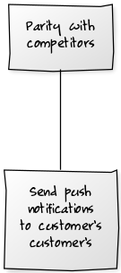
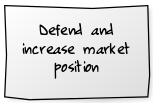
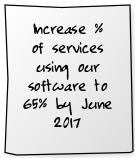
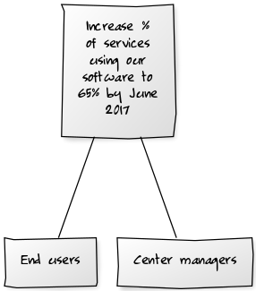
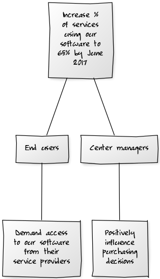
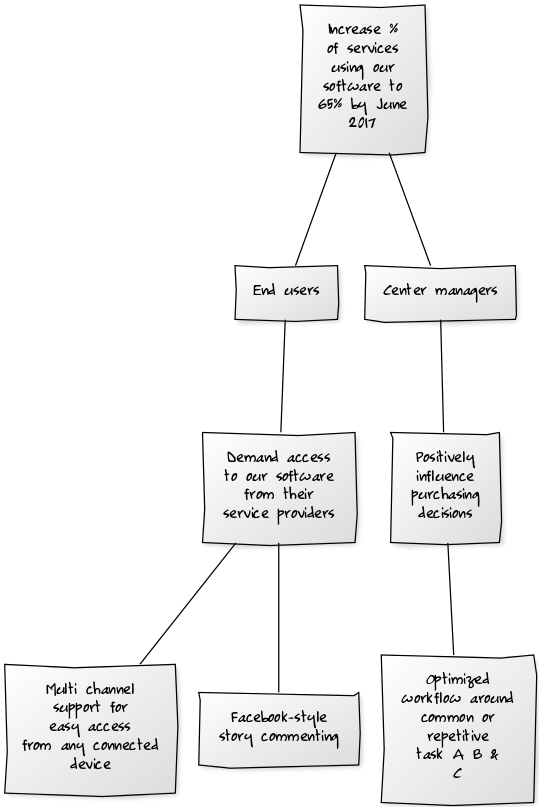

A good software development team is faster than a not-so-good one. Maybe twice as fast, but there is a definite limit. The **real** productivity difference that experienced developers learn is to minimize waste. *It's all about what you don't build*. 

Assuming that the customer knows what they want and simply doing what you are told is the surest way to fail. 

> Truly productive software development teams optimize their customer's path to their goal.

To do that you have to understand what the goal is, and how to get there. 

The Goal Tree
=========

The goal tree is a simple exercise that can help take a customer from a specific stated requirement, to a more general and valuable goal, then back to the correct specific requirement. This is done to:

1. Establish that the stated requirement, and the real underlying goal (business goal) are in fact linked.
1. To validate that the stated requirement is the correct one to pursue, or identify a better requirement.

Proceedure
----------

Start with the stated requirement: 

> "we would like you to enhance our mobile application to send our customer's customer's push notifications when certain events happen"

Recursively ask, "yeah, but why?"

 

and draw the hierarchy of goals.

> "Our competitors have the feature and we want parity"

"Yeah, but why?"

> "From a traditional monopoly we are facing many emerging competitors and they are stealing market share. We want to stop that."

"Yeah, but why?"

> "Our business is software sales into a fixed market. Market share == profit, therefore we must maintain and grow market share"

"Yeah, but why?"

> "Our MD would like a bigger boat"

At some point it always comes back to a boat for someone. Stop there. Search down the list of goals until you find the most useful strategic goal. It is not the *bigger boat for MD* goal because that one is too likely to lead to a life of crime. In this example the most useful goal is:

> "From a traditional monopoly we are facing many emerging competitors and they are stealing market share. We want to stop that."

Delete all the others. 

Perform an impact mapping to derive requirements from the identified goal. Compare it to the original starting position. 

The Impact mapping
------------------

Impact mapping is a technique designed to help us [deliver business goals, not just software features](https://www.impactmapping.org/delivering.html). According to the website:

> "impact maps allow us to maintain a dynamic roadmap that changes with our learning, keeping the goal in mind and making features and scope secondary to it. We visualise assumptions, which allows us to change direction once these assumptions are proven or discarded"

### Goals

Start with the selected goal. I have reframed it slightly.

Of course we should make our goals [SMART](https://en.wikipedia.org/wiki/SMART_criteria). 

### Actors

Next, we identify the actors who can influence (positively or negatively) the outcome.

### Impacts

For each actor list the **impacts** that we are trying to create. How can that actor help us achieve our goal? How do we want their behaviour to change?

### Deliverables

Now we are finally approaching the level of software, where we started.

Deliverables are the things we can do to support each impact. They often involve a hefty assumption that should be tracked and revisited. Does this deliverable really support its impact?

The implication is that if we deliver the features listed at the bottom, then we will get the impacts identified for the actors, which leads to achieving the goal. 

Note that the original requirement does not appear in the impact map, suggesting that there may not be a clear chain of reasoning back to the actual goal. The three deliverables identified in the impact map may represent move valuable work items. 

The goal tree is one technique that can help high performance development teams to reduce waste and creates more value in less time. 