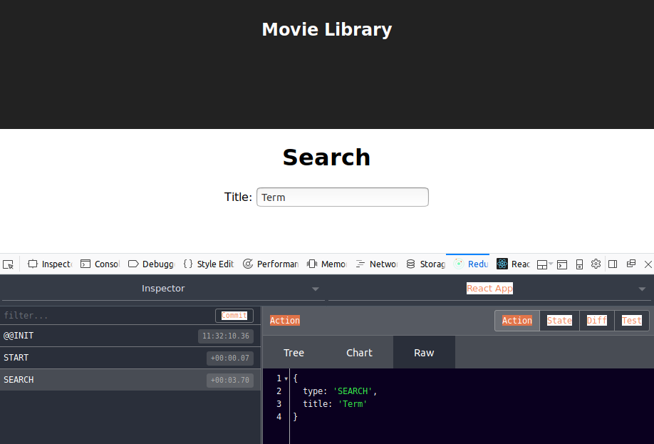
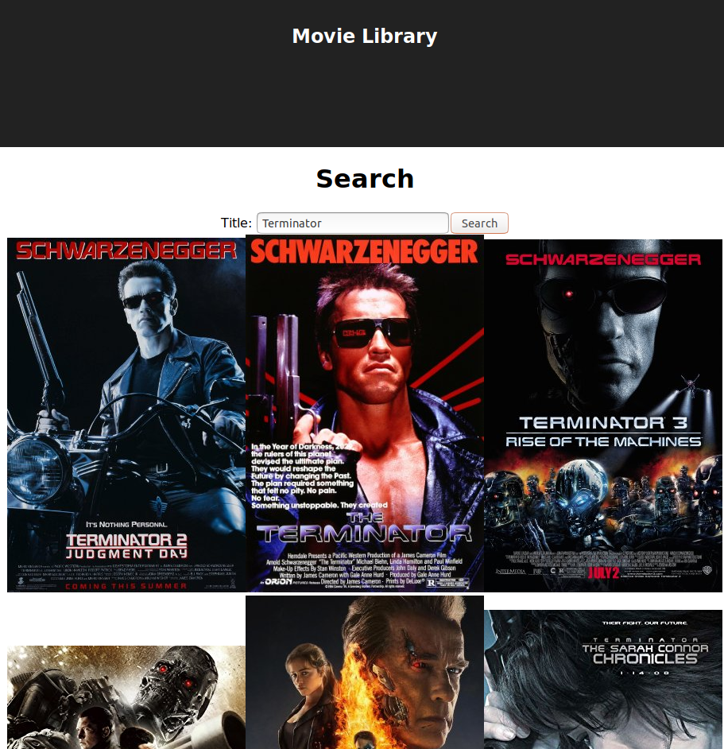

The [last post](/articles/2018-01-10-react-7-ajax/) started implementing our new demo application - the movie library. We were forced to introduce a React class component with state to make the search form work. 

When we type in the search text box and submit the form the expected action is sent to the redux store, as you can see in this screenshot featuring [redux-devtools-extension](https://github.com/zalmoxisus/redux-devtools-extension).




Routing
=======

For this example we are going to use [*redux-first-router*](https://github.com/faceyspacey/redux-first-router#the-gist). As [mentioned previously](/articles/2018-01-08-react-6-react-router/) *redux-first-router* binds routes to actions. We must handle those actions and update the UI accordingly. 

See [the redux-router documentation](https://github.com/faceyspacey/redux-first-router#the-gist) for the full documentation, but we need to make `index.js` look like this:

```javascript
import React from 'react';
import ReactDOM from 'react-dom';
import './index.css';
import registerServiceWorker from './registerServiceWorker';
import { createStore, combineReducers, applyMiddleware, compose } from 'redux';
import { Provider } from 'react-redux';
import { connectRoutes } from 'redux-first-router';
import createHistory from 'history/createBrowserHistory';
import App from './App';
import {searchReducer} from './Search';

const routesMap = { 
  HOME: '/'
};

const { reducer, middleware, enhancer } = connectRoutes(createHistory(), routesMap)

const store = createStore(combineReducers({
    location: reducer,
    search: searchReducer
}), compose(enhancer, applyMiddleware(middleware),
window.__REDUX_DEVTOOLS_EXTENSION__ && window.__REDUX_DEVTOOLS_EXTENSION__()));

ReactDOM.render(
    <Provider store={store}>
        <App />
    </Provider>, 
    document.getElementById('root'));

store.dispatch({type: "START"});

registerServiceWorker();
```

`routesMap` defines the mapping between action types and routes. Here we are saying that the route `/` should map to the `HOME` action type. The *redux-first-router* state is put into the store on the `location` key. 

Next we connect the `App` component to the Redux store:

```javascript
function App({type}) {
    const componentMap = {
      HOME: ConnectedSearch
    };
    const View = componentMap[type];

    return (
      <div className="App">
        <header className="App-header">
          <h1 className="App-title">Movie Library</h1>
        </header>
        <View />
      </div>
    );
}

export default connect(function mapStateToProps(state) {
  return state.location;
}, 
(dispatch) => ({}))(App);
```

*redux-first-router* puts route information into the redux store when a route is matched. `mapStateToProps` extracts the `location` key from the store, which is then used in the `App` component to extract the `type` value.

`connectMap` maps route action types to React components. If the route action type is `HOME` then `View` will be a `ConnectedSearch`, which is what we want for the home page.

AJAX Actions
==========

The difficulty we encounter when trying to search for a movie (via an AJAX request) is that we can't take the search action (`{ type: "SEARCH", title: "Term" }`) and update the UI state from that. We need to make an asynchronous request in the middle. 

Nearly every React application must overcome this difficulty. There are lots of different solution and I will present one. 

First, install [redux-promise-middleware](https://github.com/pburtchaell/redux-promise-middleware/blob/master/docs/introduction.md). 

```bash
$ npm install redux-promise-middleware --save
```

*redux-promise-middleware* is a library that intercepts actions that carry a promise (`SEARCH`). When the promise resolves the library dispatches a new action with the result (`SEARCH_FULFILLED`).

We create a promise using the fetch API to make a request to omdbapi to search for movies by title. 

We dispatch:

```javascript
dispatch({
    type: 'SEARCH',
    payload: fetch(`http://www.omdbapi.com/?apikey=8e4dcdac&s=${encodeURIComponent(title)}`)
        .then((response) => response.json())
});
```

and in the reducer look for `SEARCH_FULFILLED`:

```javascript
export function searchReducer(state = {results: []}, action) {
    switch (action.type) {
        case "SEARCH_FULFILLED":
            return Object.assign(
                {}, 
                { results: action.payload.Response 
                        ? action.payload.Search.filter(({Poster}) => Poster !== "N/A") 
                        : []});
        default: return state;
    }
}
```

Now look at our amazing application!



The complete `Search.js` is:

```javascript
import React from 'react';
import { connect } from 'react-redux';

class SearchForm extends React.Component {
    constructor(props) {
        super(props);
        this.state = {title: ""}
        this.titleChange = this.titleChange.bind(this);
        this.search = this.search.bind(this);
    }

    titleChange(event) {
        this.setState({title: event.target.value});
    }

    search(event) {
        event.preventDefault();
        this.props.onSearch(this.state.title);
    }

    render() {
        return <div><form onSubmit={this.search}>
            <label htmlFor="title">Title: </label>
            <input type="text" name="title" value={this.state.title} onChange={this.titleChange}/>
            <input type="submit" value="Search"/>
        </form>
        </div>;
    }
}

function Search({ onSearch, results = [] }) {
    return <div>
        <h1>Search</h1>
        <SearchForm onSearch={onSearch} />
        <div>
            {results.map(({Title,Poster,imdbID})=> )}
        </div>
    </div>;
}

export const ConnectedSearch = connect(
    function mapStateToProps(state) {
        return state.search;
    }, 
    function mapDispatchToProps(dispatch) {
        return {
            onSearch: (title)=> {
                dispatch({
                    type: 'SEARCH',
                    payload: fetch(`http://www.omdbapi.com/?apikey=8e4dcdac&s=${encodeURIComponent(title)}`)
                            .then((response) => response.json())
                  });
            }
        };
    }
)(Search);

export function searchReducer(state = {results: []}, action) {
    switch (action.type) {
        case "SEARCH_FULFILLED":
            return Object.assign(
                {}, 
                { results: action.payload.Response 
                        ? action.payload.Search.filter(({Poster}) => Poster !== "N/A") 
                        : []});
        default: return state;
    }
}
```

Summary
=======

First, we setup *redux-first-router* and implemented the `HOME` route. Then we introduced *redux-promise-middleware* as a way of inserting asynchronous operations into the redux data cycle. 

Get The Code
------------

The code for this example is [on Github](https://github.com/liammclennan/movie-library). You can access the code as it was at the completion of this step by cloning the repository and checking out the tag that corresponds to this post. 

```bash
git clone https://github.com/liammclennan/movie-library.git
git checkout react8 
```

or browse at https://github.com/liammclennan/movie-library/tree/c93c652fa1318ce6447d985e3f8b690386456565.