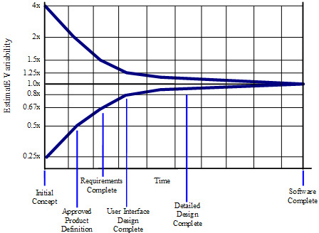

Maybe not so much "wrong" as 30 years ago. The software development community has continued to learn and discover new approaches that produce better results. This article is a critique of Mcconnell's [17 Theses on Software Estimation](https://stevemcconnell.com/blog/17-theses-software-estimation/).

This came up following responses to my article, [How To "Estimate" Without Estimating](https://withouttheloop.com/articles/2019-01-27-estimate-without-estimating/)

Let's take Mcconnell's points in turn. 

### 1. Estimation is often done badly and ineffectively and in an overly time-consuming way. 

Classic you're holding it wrong. 

 

I'm not saying he is wrong, just that it doesn't add anything to the conversation. You can defend any practice by claiming that everyone but you is doing it wrong. 

I do partly agree with Mcconnell. Practices like "planning poker" have always seemed silly to me. Even if it produces better estimates (not saying it does) the massive cost is not worth it.

### 3. Many comments in support of #NoEstimates demonstrate a lack of basic software estimation knowledge. 

My complaint is similar to before. This comment adds nothing and is just insulting the other side. It is even a variation on "you're holding it wrong". This time it's "you lack knowledge". Obviously, this is not an argument. 

### 4. Being able to estimate effectively is a skill that any true software professional needs to develop, even if they don’t need it on every project. 

100% agree. As I said in my article, estimation is essential. Estimation a backlog and using that as the basis for a project is the mistake. Without some level of estimation it would be impossible to schedule anything. 

### 5. Estimates serve numerous legitimate, important business purposes.

Again, this is a valid statement. His first example, "allocating budgets to projects" is pretty much the only legitimate use of estimates for most circumstances. 

He then makes a valid criticism of "#NoEstimates" advocates for criticising estimates without providing anything resembling an alternative. He then returns to criticising them for not being able to estimate properly and throws in a sick burn, "improved estimation skill should be part of the definition of being a true software professional". This is odd, since Mcconnell has previously conceded that professional software estimators cannot reliably predict the future, and that estimates at project inception are frequently off by 400%:

> The primary purpose of software estimation is not to predict a project’s outcome; it is to determine whether a project’s targets are realistic enough to allow the project to be controlled to meet them."

His own graphic makes the same point.

According to this, we can reduce the uncertainty to 50%, by completing the detailed requirements. That is, if we give up on agility and spend 1/3 of the cost of the project, we can get a wildly inaccurte estimate. 

### 7. Estimation and planning are not the same thing, and you can estimate things that you can’t plan.

Completely agree. This topic demonstrates that much of the disagreement is just confusion about what we mean by "estimate". The way that McConnell uses "estimate" is not the way that 99% of the software development industry uses it. When people talk about estimating they mean: define the solution, break it down, add up guesses about how long the pieces will take. 

If you remove the planning part from the estimation then the problems with estimation largely go away, so long as the uncertainty involved (400% according to McConnell) is understood and accepted by everyone. 

### 8. You can estimate what you don’t know, up to a point. 

"Most projects contain a mix of precedented and unprecedented work, or certain and uncertain work" McConnell says. Here we start to see that McConnell's conception of knowledgable, professional estimator is a person who essentially builds the same project over and over, and can notice how long it takes. It is rediculous to claim that estimation is a matter of experience and skill when you are excluding any original work by definition. Estimating things that you have not done before is the only kind that makes sense to discuss. If you have done it before, why are doing it again?

### 9. Both estimation and control are needed to achieve predictability. 

Once again the disagreement is down to how you define "estimation". If you are estimating a defined solution then this point is invalid. Control has already been given away. When McConnell says estimation here he means estimating a solution that has not been defined. 

### 10. People use the word “estimate” sloppily. 

Agreed. The irony is palpable. McConnell manages to argue for estimation by assuming a definition that nobody else has. Just like the time that [someone argued for a wall that everyone else thought was a fence](https://www.vice.com/en_ca/article/qvqa7v/trumps-wall-is-now-a-fence-or-maybe-nothing-at-all).

### 11. Good project-level estimation depends on good requirements, and average requirements skills are about as bad as average estimation skills. 

McConnell starts by saying that it is possible to get good requirements. This is easily disproven with a simple scenario.

An ecommerce project is delivered over 10 iterations. After the first iteration the product is shipped to real users, who interact with it in ways that do not entirely match the assumptions made during development. For iteration two the teams makes substantial changes that produce a far more successful outcome. Unless McConnell has a crystal ball he cannot possibly have had correct requirements in advance of actual product usage, and without knowing what the product needed to be he would have a hard time producing those amazing knowledgable, professional estimates. 

This is what I mean about McConnell having an excellent interpretation of what was known about software development thirty years ago. He proves this further by arguing that businesses should abandon agility in favour of predictibility. He values predictibility even if it means knowingly building the wrong thing. About this time I started wondering how long McConnell has been in a bunker. Maybe one behind a waterfall. 

### 12. The typical estimation context involves moderate volatility and a moderate levels of unknowns

"The typical software project has requirements that are knowable in principle, but that are mostly unknown in practice due to insufficient requirements skills." Once again, everyone except McConnell is doing it wrong. 

### 13. Responding to change over following a plan does not imply not having a plan. 

This is another point on which we completely agree. Before starting to write code, we should think. I think where we disagree is that my idea of a plan is not a backlog. 

McConnell ridiculues "treating 100% of the project as emergent" and implies that 0% of the project should be emergent, stating that typical projects are, "amenable to having both effective requirements work and effective estimation work performed on those projects, given sufficient training in both skill sets".

We both believe in planning, I just don't think that planning requires detailed requirements specification. 

### 14. Scrum provides better support for estimation than waterfall ever did, and there does not have to be a trade off between agility and predictability. 

McConnel supports his argument for estimation based on projecting from a measured velocity. All the time he has been arguing that professionals can produce effective estimation he has neglected to mention that they have to start the project first. 

### 16. This is not religion. We need to get more technical and economic about software discussions. 

McConnell says, "I’ve seen #NoEstimates advocates treat these questions of requirements volatility, estimation effectiveness, and supposed tradeoffs between agility and predictability as value-laden moral discussions". This is in the same article where he previously described these people as lacking knowledge and skill because they hold an opinion different to his. 

Summary
======

#NoEstimates folk say estimation doens't work. They mean that you can't guess how much effort will be required to implement something before you've started, and if you could you would have had to commit to a big-design-up-front waterfall process. 

McConnell says that estimates are useful and possible if you do his training course and are a "professional". He means that if you make a substantial upfront investment to define the requirements, and are prepared to stick to that plan, even when you learn it is wrong, then you can produce an estimate with only 50% uncertainty. You are free to change the requirements (be agile) but that invalidates your estimate. 

They agree on the basic facts  but manage to make an argument by being sloppy with definitions. 