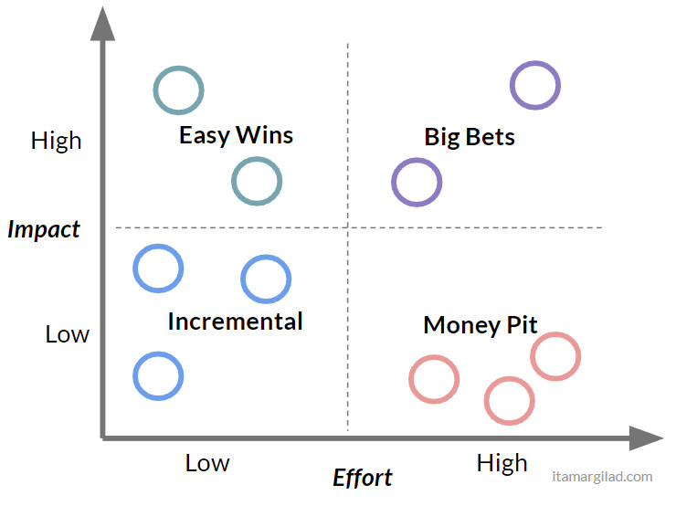
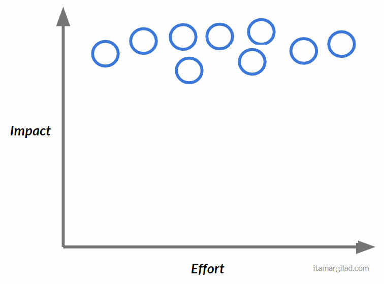
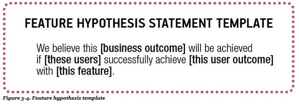

# Impact/effort matrix

An Impact/Effort Matrix is a quadrant model that ranks initiatives by impact and effort. 

*How the Impact/Effort Matrix is supposed to work*

It is meant as a rough strategic planning tool that can separate high net value initiatives (easy wins) from low net value initiatives (money pit). [Itamar Gilad](https://www.linkedin.com/pulse/why-prioritization-impacteffort-doesnt-work-itamar-gilad/) explains that it does not work because we cannot reliably estimate effort or impact. Many of the identified high-impact, low-effort initiatives will turn out to be low-impact and high-effort. They are also likely to have no impact or a negative impact. Thus, he suggests the matrix is more like this:

*Impact/Effort Matrix in practice*

The reason to use a tool like the Impact/Effort Matrix is to combat the bias in favour of pet projects. However, because the impact assessment is entirely subjective what happens, in my experience, is that people simply push their pet projects to the high-impact side. Every matrix ends up looking like this:

Thus we learn nothing about how to prioritize investments. 

# Impact mapping

[Impact mapping](https://www.impactmapping.org/about.html) is another technique that attempts to solve the same investment decision problem. 

*from https://www.impactmapping.org/drawing.html*

Rather than a subjective assessment of impact, Impact Mapping requires a causal mapping of initiatives to goals. Instead of simple saying, "chats will be high impact" I have to make the case that **implementing chats** will cause the **super-fans with mobile devices** to **stay longer** thus **growing mobile advertising**. In this way Impact mapping is a collaborative strategic planning tool that documents not just what we might do, but why and how that thing will be useful. 

Each step in the chain forms a hypothesis, that can be validated by an experiment, such as user testing with a prototype, or an MVP. They can be formulated into the "Feature Hypothesis Statement Template" (from [Lean UX](https://www.amazon.com/Lean-UX-Designing-Great-Products/dp/1491953608)):

To use the previous example:

> We belienve **growing mobile advertising** will be achieved if **super-fans with mobile devices** successfully achieve **staying longer** with **chats**. 

Impact Mapping provides a structured framework for evaluating *things we might do*. It doesn't magically deliver an optimal investment plan but it does surface the assumptions we are using, allowing us to test them, track them, and correct them when they turn out to be wrong. 