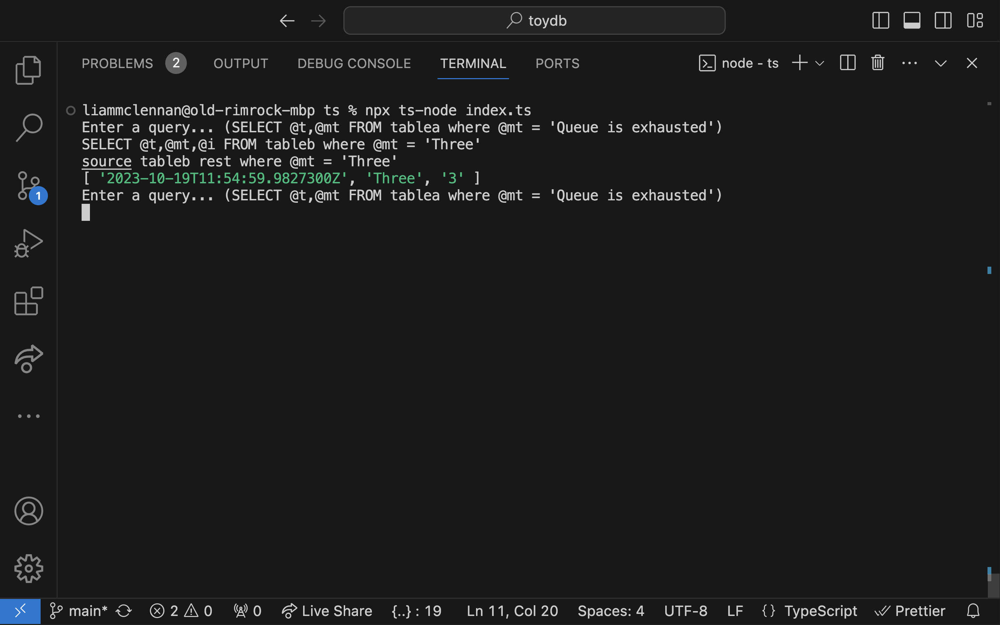

At [work](https://datalust.co/seq), I contribute to a database called [Flare](https://blog.datalust.co/rust-at-datalust/). 

Flare, and database technology in general, is fascinating and deeply rewarding, but it is also huge, complex and inscrutable :D

Because I think databases are interesting, and I hope others may too, I started building a new database, called Wormwood. Originally, I called it ToyDB, because it is, but there is already at least one of those (it's cool) so I changed the name to Wormwood.

Wormwood is being built in parallel in Typescript (because it is accessible) and Rust (because it will help me learn Rust).

I hope to keep Wormwood very, very simple so that it may serve as a demonstration of the concepts that make more sophisticated databases possible. This quickly leads to decisions that prevent it from being a useable database, and that is ok. Wormwood will never be useful for anything other than experimenting with database technology. 

If you'd like a quick introduction to the terrain you could do worse that [Architecture of a Database System] (Hellerstein, Stonebraker and Hamilton). It describes a core type used to build data pipelines that looks like this:

```ts
type Row = any[];
type RowMarker = "end of file";

interface Iter {
    constructor(inputs: Iter[]): Iter;
    next(): Promise<Row | RowMarker>;
}
```

Instances of this `Iter` type (or similar) are connected into a pipeline. When a value is required a consumer calls `next()` on the iterator at the top of the stack and it calls `next()` on down the stack until somewhere there is an `Iter` that reads tuples from disk. In Wormwood this `Iter` is called `Producer` (because it produces rows).

Producer
--------

The disk format for Wormwood is [CLEF](http://clef-json.org/) (newline delimited JSON). It is easy to work with in JavaScript and it is familiar to me. CLEF looks like this:

```json
{"@t":"2023-10-19T11:54:57.9827300Z","@mt":"One","@i":"1"}
{"@t":"2023-10-19T11:54:58.9827300Z","@mt":"Two","@i":"2"}
{"@t":"2023-10-19T11:54:59.9827300Z","@mt":"Three","@i":"3"}
{"@t":"2023-10-19T11:55:00.9827300Z","@mt":"Four","@i":"4"}
{"@t":"2023-10-19T11:55:01.9827300Z","@mt":"Five","@i":"5"}
{"@t":"2023-10-19T11:55:02.9827300Z","@mt":"Six","@i":"6"}
```

The job of the producer is:

* to stream tuples from a CLEF file. The file could be gigabytes so it is important not to rely on reading the entire file into memory. 
* to extract properties from the CLEF objects. If a query requires the `@mt` and `@i` properties then we only want to take those. 
* to convert a JSON object into a tuple row format. In Typescript this is the `type Row = any[]` type that the `next()` function returns. 
* to convert node.js's push based streams into the `Iter`s pull model, by opening a stream, pushing data into a buffer, and letting `next()` pull from the buffer. This is why `next()` is asynchronous - if the buffer is empty the producer needs time to read another chunk from disk. 

Here is the `Producer` constructor:

```ts
constructor(table: string, columns: string[]) {
    this.filePath = Path.join(__dirname, "../../data", `${table}.clef`);
    this.columns = columns;
    this.open();
}
```

'Tables' map to files in the `/data` directory - so `select a, b from table1` will open the file `/data/table1.clef`. The `open()` method opens the file and starts streaming chunks into the buffer and is an abomination that I won't soil your eyes with. 

`Producer`s `next()` method tries to grab a row from the buffer, and then feeds it through this function to convert it into an array of the requested properties:

```ts
makeRow(line: string): any[] {
    const parsed = JSON.parse(line);
    return this.columns.map((c) => parsed[c]);
}
```

That is the state of the `Producer` iterator at the moment. The typescript implementation is hideous and will hopefully get cleaned up. The Rust version is gorgeous.

Here's me running a query:


