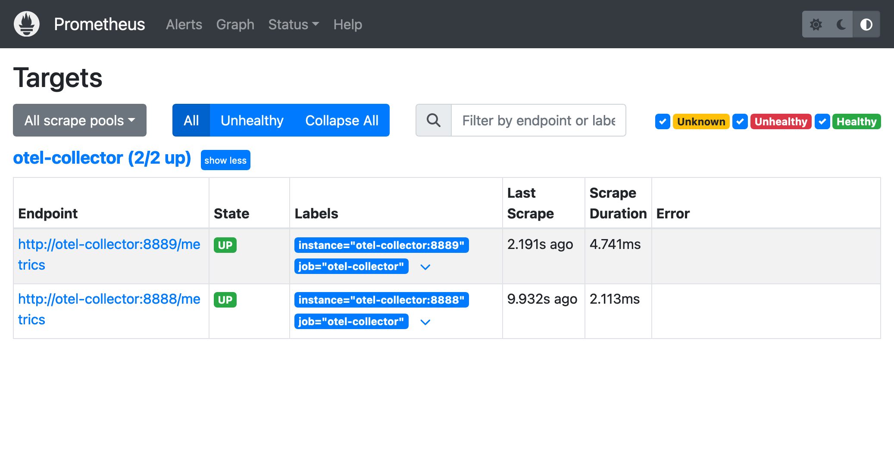
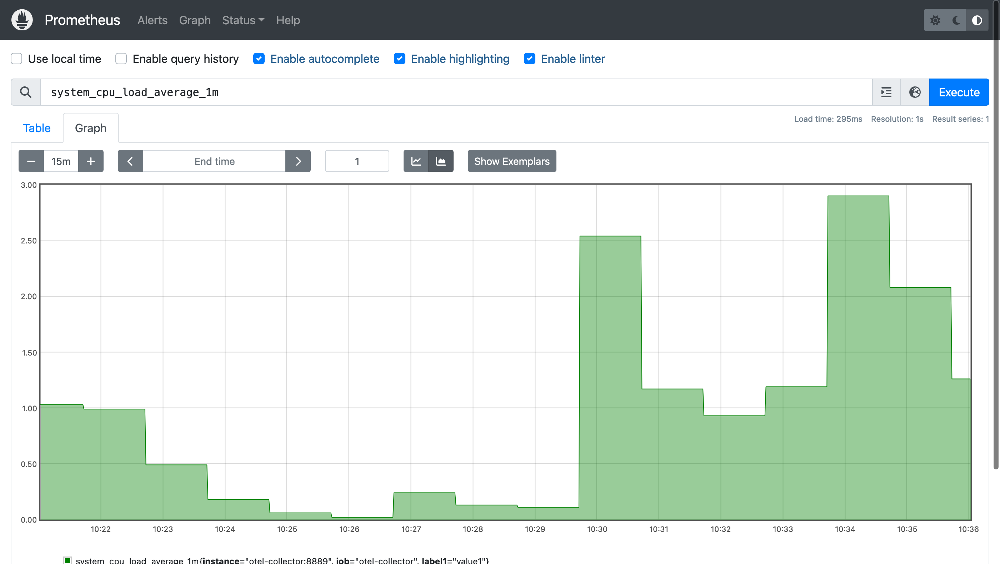
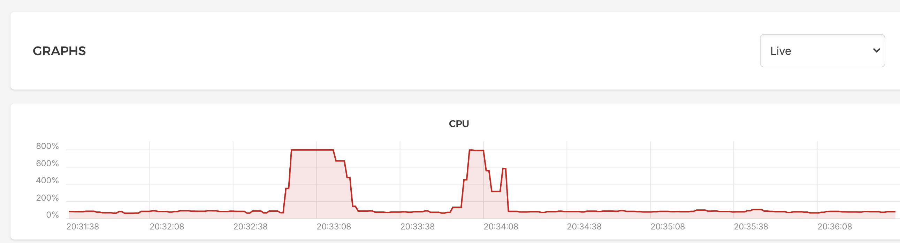

When you have a bunch of servers to monitor, it is a good idea to keep an eye on what they are doing. *CPU usage*, *memory usage* and *remaining disk space* are some examples of *metrics* that need to be monitored. 

In addition to its usual role as OpenTelemetry middleware, the OpenTelemetry collector can function as a host metrics agent, collecting host metrics and forwarding them to storage and analysis systems. 

The default storage and analysis choice for metrics is Prometheus, sometimes with Grafana on top for more sophisticated visualization. 

Let's see what it takes to deploy host monitoring using the OpenTelemetry collector and Prometheus. 

> The [full demo code is available on GitHub](https://github.com/liammclennan/otel-collector-prometheus-demo).

## 1. The OpenTelemetry Collector

I will be using Docker Compose to deploy the collector and Prometheus on the same host. In a file `compose.yaml` add a service for the OpenTelemetry collector, connected to a custom Docker network. 

```yaml
services:
  otel-collector:
    image: otel/opentelemetry-collector-contrib:latest
    hostname: otel-collector
    networks:
      - collectorandprometheus
    restart: always
    command: ["--config=/etc/otel-collector-config.yaml"]
    volumes:
      - ./otel-collector-config.yaml:/etc/otel-collector-config.yaml

networks:
  collectorandprometheus: {}
```

Note that it maps a local config file to `/etc/otel-collector-config.yaml` in the container file system. The container publishes no ports, because it is on its own network and we don't need to access the collector from outside the docker network. 

The OTel collector config file declares and configures a `hostmetrics` receiver, and a prometheus exporter, then wires them together in the metrics pipeline.

```yaml
receivers:
  hostmetrics:
    collection_interval: 1m
    scrapers:
      cpu:
      load:
      memory:
      disk:
      filesystem:
      network:
      paging:
      processes:

exporters:
  prometheus:
    endpoint: "otel-collector:8889"

service:
  pipelines:
    metrics:
      receivers: [hostmetrics]
      exporters: [prometheus]
```

The endpoint `otel-collector` is a reference to the hostname of the otel-collector container in the Docker Compose file. The Prometheus exporter doesn't send metrics anywhere, it exposes an endpoint for Prometheus to poll and `otel-collector:8889` is the address of that endpoint.

## 2. Prometheus

The Prometheus service is declared in the same `compose.yaml` Docker Compose file and added to the same Docker network. 

```yaml
prometheus:
    image: prom/prometheus:latest
    hostname: prometheus
    networks:
      - collectorandprometheus
    restart: always
    ports:
      - 9090:9090
    volumes:
      - ./prometheus.yaml:/etc/prometheus/prometheus.yml
```

Since Prometheus is on a Docker network it must publish a port to be visible from outside. It also has its own configuration file mapped into the container. The contents of `prometheus.yaml` is:

```yaml
scrape_configs:
  - job_name: 'otel-collector'
    scrape_interval: 10s
    static_configs:
      - targets: ['otel-collector:8889']
      - targets: ['otel-collector:8888']
```

This configures Prometheus to poll the OTel Collector, every ten seconds, for metrics. Once again, `otel-collector` here is a reference to the hostname of the OpenTelemetry collector service in the Docker Compose file. 

The system can now be started with `docker compose up`.

After running for a while you will be able to access Prometheus (`localhost:9090`) and see the targets page:



And Prometheus will be able to answer queries about host metrics:



Which align with metrics gathered via other tools:



These are not the only way to collect host metrics. There are many other host agents that do the same thing, but if you happen to need an OpenTelemetry collector anyway then it is handy to be able to use it for host metrics too.    
