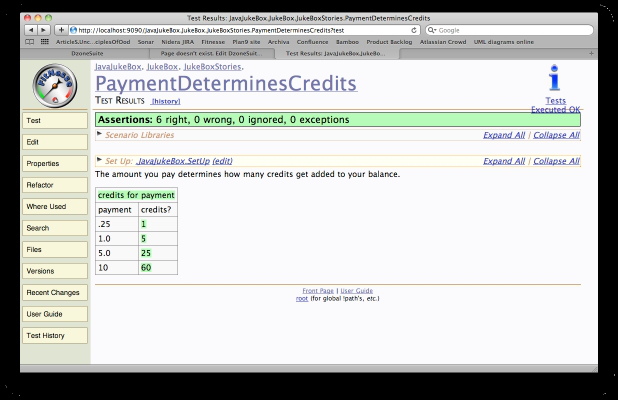
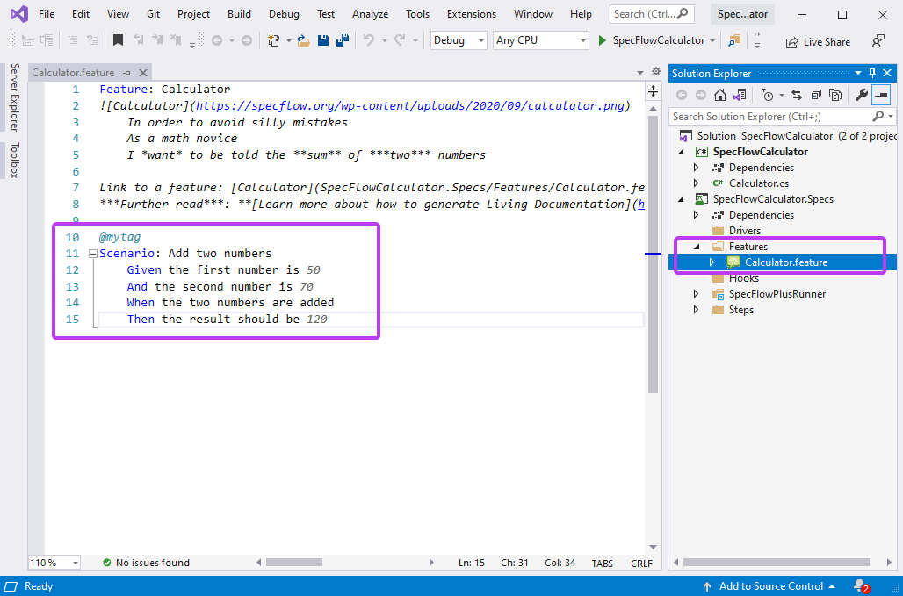

"The cost of software is approximately equal to the cost of change", says [Larry Constantine](https://vtda.org/books/Computing/Programming/StructuredDesign_EdwardYourdonLarryConstantine.pdf) via [Kent Beck](https://www.youtube.com/watch?v=yBEcq23OgB4&t=1497s). 

It is ironic that Kent Beck should propagate this idea, given that he created XP, with ephemeral user stories as work items for system development. It is a weakness of Agile processes that when v1 of a project ships there is no artifact that captures what the system does. There are a series of user stories, representing changes, that were applied in sequence to produce a result - but no clear idea of what that result is. Agile was a great improvement, but in this respect it was a regression. 

Up through the 80s good software development practice was to divide a project schedule into thirds: a third to define the system, a third to build it, and a third to test that the specification and the implementation match. This approach was justified by the flawed assumption that creating software is like a civil engineering project, which it is not. However, civil engineering projects have one great advantage. A bridge is built from a design and when the bridge has been built the design is an accurate description of the bridge. When software development outgrew the civil engineering model the system specification was collatoral damage. 

If Constantine and Beck are correct about the cost of change then having a correct software specification is invaluable. How can we efficiently maintain a system if we don't know exactly what it does? This is not a new observation, but keeping an accurate specification of a complex system is hard. 

Accurate software specification is a problem of synchronization. Good programmers know that synchronization is a source of bugs and should therefore be avoided. This is done in software by ensuring that things have a single, canonical representation, from which other representations derive. So of course, attempts to solve the software specification problem have tried to follow the same model, with some variation on combining specification with automated tests as a way of verifying that a system matches its specification, while both are constantly changing. There were fit and fitnesse, which put the tests into the specification. 

There were rSpec and other BDD tools, which put the specification into the tests. Both of these approaches struggled because a specification is not an automated testing tool, and an automated testing tool is not a specification. 

Agile left a hole where the system specification should be. Despite many attempts to fill the void, progress has been minimal. I hope that one day we will find a solution. 