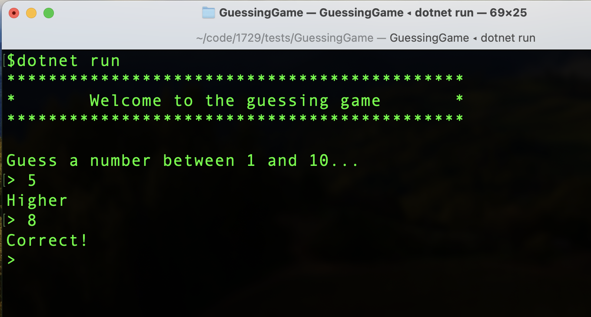
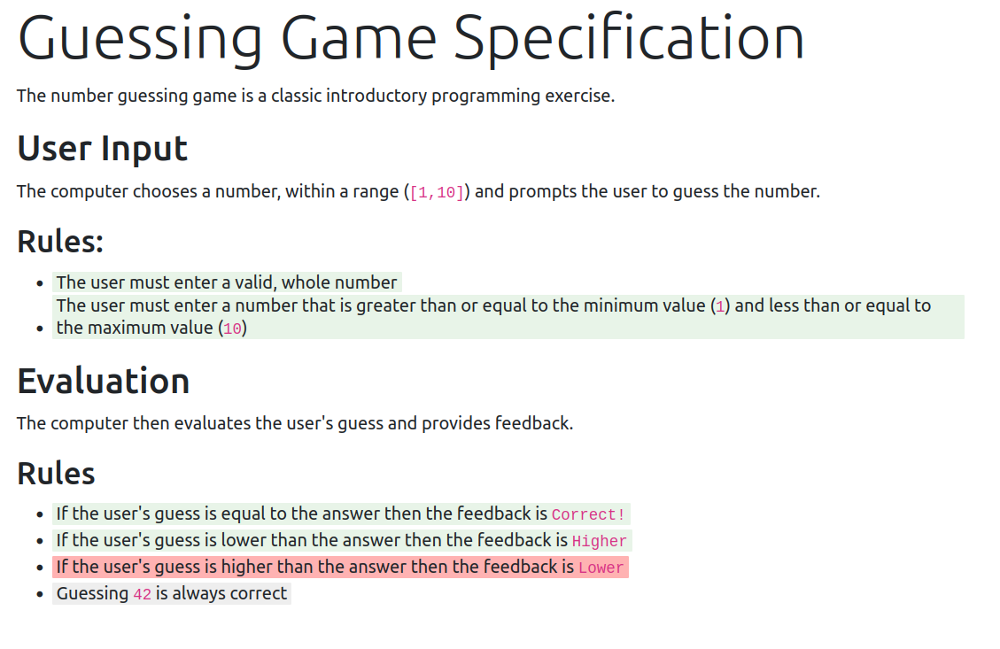

It has bugged me for years that software projects are not properly defined anywhere - except in the code - and that is not a human readable specification. 

Complex, long-lived computer programs are easier to extend and maintain if they have a clear, verified, specification. Specifications are valuable, but they, "are not a natural byproduct of incremental development" (thanks Andrew Best). 

For [various reasons](/articles/2024-06-04-living-specification/) the industry has drifted away from producing specifications, however it seems there may be a practical way to make specifications useful.

What if we:

1. let specification writers write specifications the way that they want?
1. let software developers write automated tests the way that they want?
1. map the specificaton statements to the tests that verify them and publish the result?

This adds rigour to the idea of [readme driven development](https://tom.preston-werner.com/2010/08/23/readme-driven-development). As Tom Preston-Warner said, "a perfect implementation of the wrong specification is worthless... a beautifully crafted library with no documentation is also damn near worthless".

We can explore this idea with a simple example.

The Number Guessing Game
--------

The number guessing game is a classic early programming exercise to write a program that prompts a user to guess a number. 



The product owner writes the following specification:

<div class="col col-lg-8" style="background-color: antiquewhite; padding: 20px; border-radius: 0.25em;
background-image: url(paper.png);">
        <h1 class="display-4">Guessing Game Specification</h1>
<p>The system should prompt the user to guess a number that has been randomly generated. It should provide feedback on their guesses until they guess the correct number.</p>
<h2 id="user-input">User Input</h2>
<p>The computer chooses a number, within a range (<code>[1,10]</code>) and prompts the user to guess the number.</p>
<h2 id="rules">Rules:</h2>
<ul>
<li><span data-bp-grep="WholeNumbersInRangeAreValid,NotWholeNumbersAreInvalid" data-bp-outcome="Undefined">The user must enter a valid, whole number</span></li>
<li><span data-bp-grep="WholeNumbersOutOfRangeAreInvalid" data-bp-outcome="Undefined">The user must enter a number that is greater than or equal to the minimum value (<code>1</code>) and less than or equal to the maximum value (<code>10</code>)</span></li>
</ul>
<h2 id="evaluation">Evaluation</h2>
<p>The computer then evaluates the user's guess and provides feedback.</p>
<h2 id="rules-1">Rules</h2>
<ul>
<li><span data-bp-grep="ValidGuessesEqualToAnswerSayCorrectBang" data-bp-outcome="Undefined">If the user's guess is equal to the answer then the feedback is <code>Correct!</code></span></li>
<li><span data-bp-grep="ValidGuessesLowerThanAnswerSayHigher" data-bp-outcome="Undefined">If the user's guess is lower than the answer then the feedback is <code>Higher</code></span></li>
<li><span data-bp-grep="ValidGuessesHigherThanAnswerSayLower" data-bp-outcome="Undefined">If the user's guess is higher than the answer then the feedback is <code>Lower</code></span></li>
<li><span data-bp-grep="Guessing42IsAlwaysCorrect" data-bp-outcome="Undefined">Guessing <code>42</code> is always correct</span></li>
</ul>

<p></p>
</div>

<p></p>


The developer then implements the program and produces the following tests (implementations elided as irrelevant):

```csharp
public class UserInputTests
{    
    [Fact]
    public void WholeNumbersInRangeAreValid();
    
    [Theory]
    [InlineData("")]
    [InlineData("3.141592")]
    [InlineData("cat in hat")]
    public void NotWholeNumbersAreInvalid(string input);
    
    [Theory]
    [InlineData("-5")]
    [InlineData("0")]
    [InlineData("1729")]
    public void WholeNumbersOutOfRangeAreInvalid(string input);
}

public class EvaluationTests
{
    [Fact]
    public void ValidGuessesLowerThanAnswerSayHigher();
    
    [Fact]
    public void ValidGuessesHigherThanAnswerSayLower();
    
    [Fact]
    public void ValidGuessesEqualToAnswerSayCorrectBang();

    [Fact(Skip = "Not implemented yet")]
    public void Guessing42IsAlwaysCorrect();
}
```

In this simple example it is easy to see the implied mapping between statements in the specification and the unit tests. Each bullet point in the specification maps to a single unit test, except for the first statement, `The user must enter a valid, whole number`, which maps to two unit tests: `WholeNumbersInRangeAreValid` and `NotWholeNumbersAreInvalid`.

If we add metadata to the specification, we can map each of its claims to the test, or tests, that verify them and then produce a verified specification:



All claims in the specification are highlighted. Those that have been successfully verified by the tests are green. Those that failed their tests are red, and those linked to tests that were skipped are gray. 

Having a living specification completes the link between work that developers do and the purpose of the system they are working on. It encourages the team to think before doing, and provides visibility of what the system does, what works, what doesn't, and what has not been done yet. 