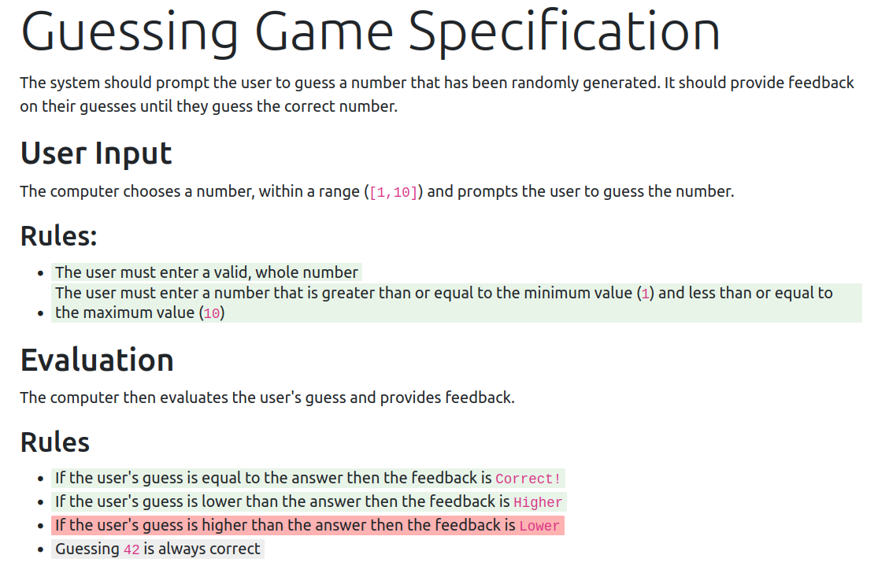

It has bugged me for years that software projects are not defined anywhere - except in the code - and that is not a human readable specification. 

What if the solution that makes living specifications work is:

> 1. let specification writers write specifications how they want
> 2. let software developers write automated tests how they want
> 3. map the specificaton statements to the tests that verify them

This just adds some rigour to the idea of [readme driven development](https://tom.preston-werner.com/2010/08/23/readme-driven-development). As Tom Preston-Warner says, "a perfect implementation of the wrong specification is worthless... a beautifully crafted library with no documentation is also damn near worthless".

Here is an example. 

The Number Guessing Game
--------

The number guessing game is a classic early programming exercise to write a program that prompts a user to guess a number. It is not fun, but it is easy to understand. 


The product owner may have written the following specification:

---------------

<div class="col col-lg-8" style="background-color: antiquewhite; padding: 20px; border-radius: 10px;">
        <h1 class="display-4">Guessing Game Specification</h1>
        <p>
            </p><p>The number guessing game is a classic introductory programming exercise.</p>
<h2 id="user-input">User Input</h2>
<p>The computer chooses a number, within a range (<code>[1,10]</code>) and prompts the user to guess the number.</p>
<h3 id="rules">Rules:</h3>
<ul>
<li><span data-bp-grep="WholeNumbersInRangeAreValid,NotWholeNumbersAreInvalid" data-bp-outcome="Undefined">The user must enter a valid, whole number</span></li>
<li><span data-bp-grep="WholeNumbersOutOfRangeAreInvalid" data-bp-outcome="Undefined">The user must enter a number that is greater than or equal to the minimum value (<code>1</code>) and less than or equal to the maximum value (<code>10</code>)</span></li>
</ul>
<h2 id="evaluation">Evaluation</h2>
<p>The computer then evaluates the user's guess and provides feedback.</p>
<h3 id="rules-1">Rules</h3>
<ul>
<li><span data-bp-grep="ValidGuessesEqualToAnswerSayCorrectBang" data-bp-outcome="Undefined">If the user's guess is equal to the answer then the feedback is <code>Correct!</code></span></li>
<li><span data-bp-grep="ValidGuessesLowerThanAnswerSayHigher" data-bp-outcome="Undefined">If the user's guess is lower than the answer then the feedback is <code>Higher</code></span></li>
<li><span data-bp-grep="ValidGuessesHigherThanAnswerSayLower" data-bp-outcome="Undefined">If the user's guess is higher than the answer then the feedback is <code>Lower</code></span></li>
<li><span data-bp-grep="Guessing42IsAlwaysCorrect" data-bp-outcome="Undefined">Guessing <code>42</code> is always correct</span></li>
</ul>

        <p></p>
    </div>

-------------

The developer then implements the program and produces the following tests:

```csharp
public class UserInputTests
{    
    [Fact]
    public void WholeNumbersInRangeAreValid();
    
    [Theory]
    [InlineData("")]
    [InlineData("3.141592")]
    [InlineData("cat in hat")]
    public void NotWholeNumbersAreInvalid(string input);
    
    [Theory]
    [InlineData("-5")]
    [InlineData("0")]
    [InlineData("1729")]
    public void WholeNumbersOutOfRangeAreInvalid(string input);
}

public class EvaluationTests
{
    [Fact]
    public void ValidGuessesLowerThanAnswerSayHigher();
    
    [Fact]
    public void ValidGuessesHigherThanAnswerSayLower();
    
    [Fact]
    public void ValidGuessesEqualToAnswerSayCorrectBang();

    [Fact(Skip = "Not implemented yet")]
    public void Guessing42IsAlwaysCorrect();
}
```

In this simple example it is easy to see the implied mapping between statements in the specification and the unit tests. If we add metadata to the specification we can map each of its claims to the test or tests that verify them and produce a verified specification:

